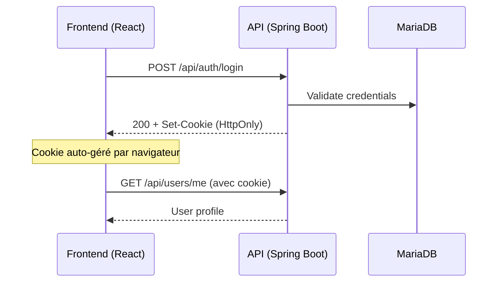

# Intégration Frontend ↔ Backend OSMAUSIA

Connexion du frontend React (`PING_front`) avec l'API Spring Boot (`PING_back`) pour l'authentification.

---

## Architecture de Communication

> **IMPORTANT** : L'API utilise des **cookies HttpOnly** - le token JWT n'est pas accessible en JavaScript. Toutes les requêtes doivent inclure `withCredentials: true`.

---

## Endpoints API Auth

| Fonction | Endpoint | Body |
|----------|----------|------|
| Login | `POST /auth/login` | `{ email, password }` |
| Register Traveler | `POST /auth/register/traveler` | `{ email, password, firstName, lastName, phone?, languagePref? }` |
| Register Provider | `POST /auth/register/provider` | `{ email, password, companyName, typeProvider }` |
| Logout | `POST /auth/logout` | - |
| Forgot Password | `POST /auth/forgot-password` | `{ email }` |
| Reset Password | `POST /auth/reset-password` | `{ token, newPassword }` |

---

## Mapping des Données

### Frontend → Backend

| Frontend | Backend | Notes |
|----------|---------|-------|
| `language: 'fr'` | `languagePref: 'FR'` | Uppercase |
| `partnerType: 'hebergeur'` | `typeProvider: 'HEBERGEUR'` | Uppercase + rename |

### Backend → Frontend

| AuthResponseDTO | User state |
|-----------------|------------|
| `userId` | `user.id` |
| `email` | `user.email` |
| `userType: 'TRAVELER'` | `user.role: 'traveler'` |
| `userType: 'PROVIDER'` | `user.role: 'partner'` |

---

## Fichiers Modifiés

- `src/services/api.js` - Client Axios
- `src/services/authService.js` - Service authentification
- `src/contexts/AuthContext.jsx` - Appels API réels
- `src/pages/RegisterTraveler.jsx` - Mapping DTO
- `src/pages/RegisterPartner.jsx` - Mapping DTO
- `src/pages/ForgotPassword.jsx` - Nouvelle page
- `src/pages/ResetPassword.jsx` - Nouvelle page
- `vite.config.js` - Proxy dev
